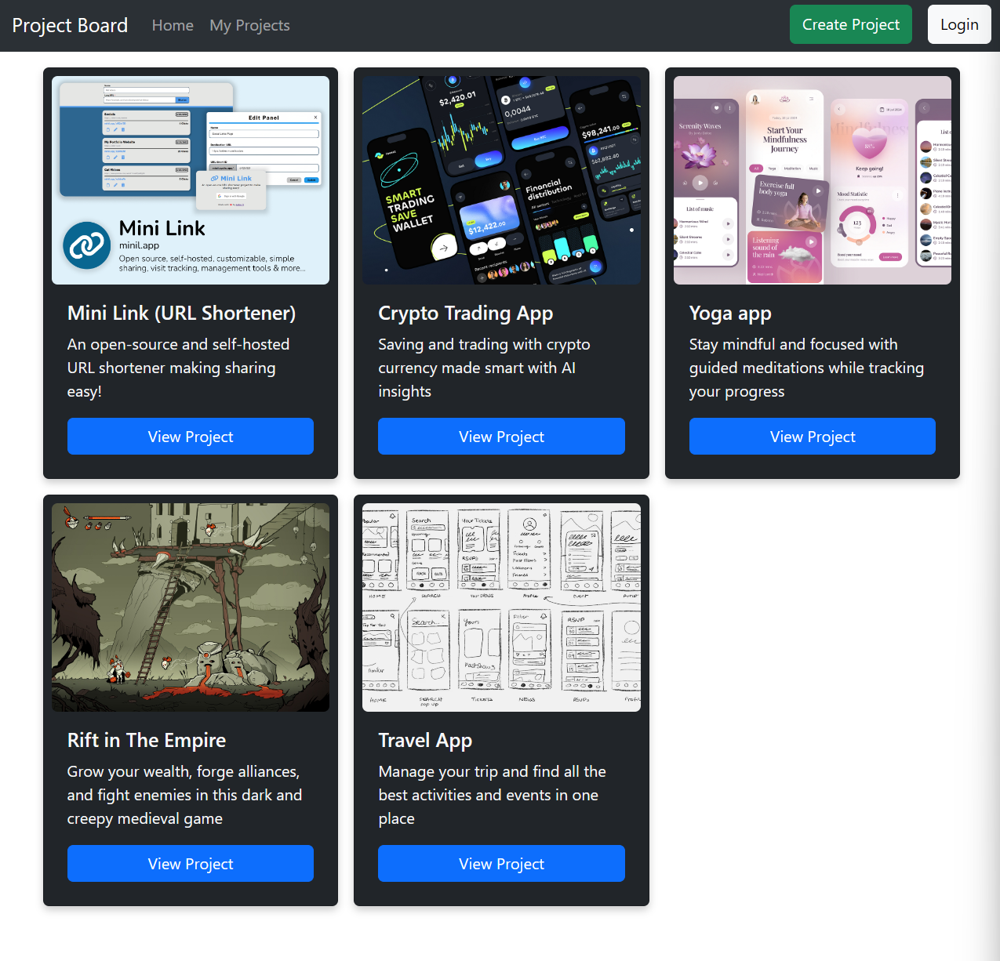
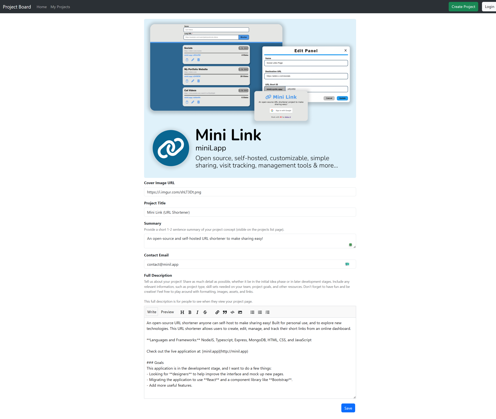
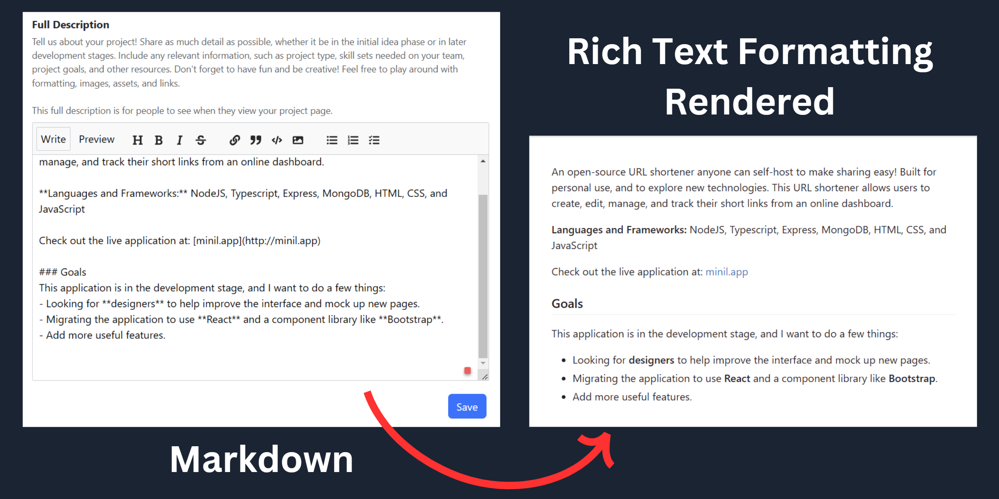

# Project Board
A project share board to help you build a team and collaborate on exciting project ideas. Features markdown support so posters have the freedom to expess their project in a unique way. **This project is still under development** and is not yet deployed.

You can find the backend server and API code at **[project-board-backend](https://github.com/Navnedia/project-board-backend.git)**. 

## Installation and Usage

1. Clone the repository onto your machine: `git clone https://github.com/bodonnell-DePaul/final-project-fe-Navnedia.git`

2. Install the npm dependencies: **`npm install --legacy-peer-deps`**

> [!WARNING]  
> Please be sure to use the **`--legacy-peer-deps`** flag when installing the npm packages! One of the libraries in this project relies on a different version of React. If you don't, it will scream at you and not work properly :(

3. Set up and get the [backend server-side](https://github.com/bodonnell-DePaul/final-project-back-end-Navnedia) running. By default, the backend sure runs on `localhost:5066`, but if you need to change the url/port on the front end, you can just update the `REACT_APP_API_BASE_URL` variable in the [`.env`](./.env) file.

4. Start the application frontend by running: `npm start`

## Screenshots
The **main page** showes off project listings to explore.

> [!NOTE]
> **Projects shown in screenshots are example content only.**

The **project creation form** lets users share their project concept, lay out the needs for their team, and provide contact information for people who are interested.

**Markdown support** with a built-in editor and preview enables simple rich text formating so users can better express their ideas using sections, headers, images, links, lists, and more.

